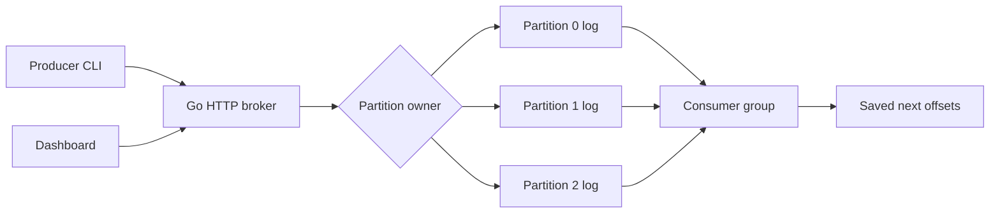

# StreamForge

StreamForge is a small distributed event-streaming system written in Go. It supports topics, partitions, persistent messages, producers, consumers, and consumer offsets. It is a project for learning how systems like Kafka organize events, with enough code to follow from an HTTP request down to a log file.

- Publish keyed or unkeyed messages to partitioned topics.
- Keep messages and group offsets after a broker restart.
- Share partitions between consumers in the same group.
- Run one broker or a small cluster with fixed partition ownership.
- Inspect broker health, throughput, partition counts, and consumer lag in a plain HTML/CSS/JavaScript dashboard.

The backend uses only Go's standard library. No database, UI build step, or Docker installation is required for local use.



## Run on Windows

Install Git and Go 1.24 or newer. These are PowerShell commands; run them from the repository root.

```powershell
git clone https://github.com/arjunram2008/StreamForge.git
cd StreamForge
```

**Terminal 1 — keep the broker running:**

```powershell
go run ./cmd/broker
```

Open **http://127.0.0.1:8080** for the dashboard.

**Terminal 2 — create a topic and publish:** open another PowerShell window and `cd` into the same `StreamForge` folder.

```powershell
go run ./cmd/topic --topic orders --partitions 3
go run ./cmd/producer --topic orders --key customer-42 --message "hello"
go run ./cmd/producer --topic orders --message "another order"
```

**Terminal 3 — keep a consumer running:** open another PowerShell window in `StreamForge`.

```powershell
go run ./cmd/consumer --topic orders --group demo --name alice
```

Messages print as JSON. Publish more messages from Terminal 2 and watch them appear in Terminal 3. Press Ctrl+C to stop. Restart the consumer with the same group to continue from the committed offsets. To replay from the beginning, use a new group name:

```powershell
go run ./cmd/consumer --topic orders --group replay --once
```

`--once` drains currently available messages and exits after an empty poll. It can also exit if this consumer currently owns no partitions.

**Terminal 2 — tests and benchmark:**

```powershell
go test ./...
go vet ./...
go run ./cmd/benchmark --n 1000 --workers 4
```

The broker must be running for the benchmark. It creates a separate `benchmark` topic and reports successful publishes per second plus mean, p50, and p95 request latency. It includes HTTP and the disk flush for each message. Repeated runs append more events. Results depend on your machine, storage, concurrency, and broker configuration; there is no promised throughput number.

## How it works

**Topics and partitions.** Each topic has 1–64 partitions. With a key, the broker chooses `FNV-1a(key) % partition_count`. Without a key, it rotates through partitions in round-robin order. That cursor is per broker and resets on restart. Ordering is guaranteed within one partition by append order, not across the whole topic. Partition counts are fixed once a topic exists.

**Persistent logs.** A partition is a newline-delimited JSON file such as `data/orders/partition-0.log`. A message contains its key, value, timestamp, partition, and zero-based offset. Each successful append is flushed with `Sync` before the broker acknowledges it. Startup scans the files to rebuild an in-memory index of byte positions. Reads seek into the files; message bodies are not all kept in memory. An incomplete final record is removed on restart. A corrupt complete record stops startup with an error.

**Offsets.** A committed offset is the *next* message to read: after processing offset 0, commit 1. Broker 0 saves group offsets in `offsets.json` using a flushed temporary file and rename. The consumer prints a batch before committing it. If it stops between those steps, messages can repeat. This is at-least-once delivery, so a real consumer should make repeated processing safe.

**Consumer groups.** Live member names are sorted, and partition `p` goes to member `p % member_count`. Polls refresh a 15-second lease. Joining, leaving, or expiring changes the assignment version. Commits include that version, so an old assignment cannot advance offsets after a rebalance. Dead members are cleaned up during polls, commits, and metrics requests. More consumers than partitions means some consumers wait without an assignment. Use a unique name for each running consumer; the default is randomly generated.

**Metrics.** `/metrics` reports stored messages, topics, partitions, group lag, peer status, and coordinator uptime. The displayed message rate is the sum of each broker's successful publishes divided by its uptime, rather than an instantaneous rate. Lag is the difference between a partition's log end and a group's next committed offset. Totals and lag are marked incomplete if a broker cannot be reached. Heartbeats probe `/health` every two seconds; this is polling, not a consensus protocol.

## Try consumer groups

Keep two consumers running in separate terminals:

```powershell
go run ./cmd/consumer --topic orders --group workers --name alice
```

```powershell
go run ./cmd/consumer --topic orders --group workers --name bob
```

With three partitions, Alice owns 0 and 2; Bob owns 1. Stop Bob and Alice takes the remaining partition after the lease expires (or immediately after a graceful leave reaches the broker). A different group independently reads the same log.

## Two brokers

Stop the single broker first. Use new data directories, and keep the same ordered peer list on both brokers.

**Broker terminal 1:**

```powershell
go run ./cmd/broker --id 0 --addr 127.0.0.1:8080 --data data/broker-0 --peers "http://127.0.0.1:8080,http://127.0.0.1:8081"
```

**Broker terminal 2:**

```powershell
go run ./cmd/broker --id 1 --addr 127.0.0.1:8081 --data data/broker-1 --peers "http://127.0.0.1:8080,http://127.0.0.1:8081"
```

Once both are running, create a new topic:

```powershell
go run ./cmd/topic --topic cluster-orders --partitions 4
go run ./cmd/producer --topic cluster-orders --message "hello cluster"
go run ./cmd/consumer --topic cluster-orders --group cluster-demo
```

Partition ownership is `partition_id % broker_count`. With two brokers, broker 0 owns 0 and 2, and broker 1 owns 1 and 3. A broker routes publishes and reads to the owner. Broker 0 holds the group coordinator; other brokers proxy group and dashboard metrics requests to it. Topic creation writes the same manifest to every broker. If creation fails partway through, restart the peer and retry the exact same topic command.

Stop broker 1 to see it become unavailable. Requests for its partitions fail clearly; healthy partitions remain accessible through the raw read/publish APIs. A group poll waits if one of its assigned partitions is unavailable. Restart broker 1 with its original command and data directory to recover. If broker 0 stops, group coordination and aggregate metrics wait for it to return; broker 1 can still serve its local partitions.

There is **no replication or automatic failover**. Fixed ownership makes routing understandable, but a stopped owner's data is unavailable until it returns. The saved cluster configuration prevents accidentally changing the broker count or ordered peer URLs for existing data. Adding brokers or moving partitions would need a separate migration design.

## Docker (optional)

Stop any local broker using port 8080, then run:

```powershell
docker compose up --build
```

Keep that terminal open. Use the same Go topic, producer, and consumer commands from another terminal. The dashboard stays at http://127.0.0.1:8080. A named volume keeps data between container restarts. Stop with Ctrl+C, then `docker compose down` to remove the containers while keeping the volume.

For two Docker brokers instead:

```powershell
docker compose -f config/docker-compose.cluster.yml up --build
```

The single-broker and cluster configurations use separate volumes. Start only one configuration at a time. The Dockerfile runs the Go tests during its build.

## Repository map

```text
cmd/                 broker, topic, producer, consumer, benchmark commands
internal/broker/     topic management, HTTP routing, health, metrics, dashboard
internal/storage/    append-only logs, metadata saves, directory writer lock
internal/partition/  key hashing and round-robin selection
internal/coordinator/ consumer assignments, leases, saved offsets
internal/client/     shared CLI HTTP helper
tests/               HTTP and multi-broker integration tests
config/              optional two-broker Docker Compose configuration
docs/                API reference, design tradeoffs, verification notes
data/                runtime files (created automatically, ignored by Git)
```

## Tests

The tests cover topic creation, key stability, round-robin distribution, concurrent writes and reads, log persistence, incomplete-write recovery, consumer offsets, group leases, stale commits, peer routing, and unavailable brokers. They use temporary directories and HTTP test servers, so the test suite does not require a running broker. GitHub Actions runs on Windows and Linux, including the Linux race detector.

For a manual restart check: publish a message, consume it with `--once`, stop the broker, restart it with the same data directory, and run that group again. It should print no old messages. A new group should replay them. See [verification notes](docs/verification.md) for the actual checks performed during implementation.

## What I learned

This project is a way to practice message partitioning, persistent logs, consumer offsets, concurrency in Go, and basic distributed systems concepts. The useful part is being able to trace why a message has a particular partition and offset, and explain what happens when a consumer or broker stops.

## Current limits

This is a local learning project: no authentication, TLS, retention, replication, leader election, or exactly-once processing. Internal endpoints trust the other brokers, so keep it on localhost or a private Docker network. Logs and the byte-position index grow until you intentionally start with a fresh data directory. Topic creation across brokers is retryable but not transactional. Disk flushes and metadata replacement cover ordinary process restarts; storage hardware failure and sudden power loss need stronger recovery guarantees. Windows, Linux, and macOS are supported by the directory lock implementations.

The [API reference](docs/api.md) and [design notes](docs/design.md) explain the small pieces without requiring Kafka knowledge.
