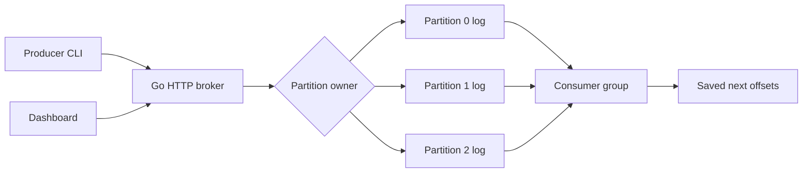

# StreamForge

StreamForge is a small distributed event-streaming system written in Go. It supports topics, partitions, persistent messages, producers, consumers, and consumer offsets. It is a project for learning how systems like Kafka organize events, with enough code to follow from an HTTP request down to a log file.

- Publish keyed or unkeyed messages to partitioned topics.
- Keep messages and group offsets after a broker restart.
- Share partitions between consumers in the same group.
- Run one broker or a small cluster with fixed partition ownership.
- Inspect broker health, throughput, partition counts, and consumer lag in a plain HTML/CSS/JavaScript dashboard.

The backend uses only Go's standard library. No database, UI build step, or Docker installation is required for local use.

